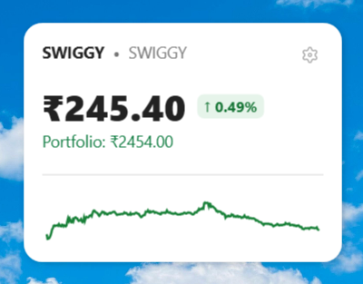
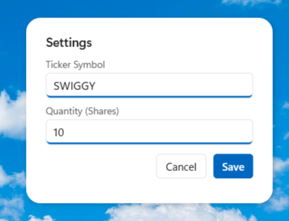

# Stocky


Stocky is a sleek, unobtrusive desktop stock ticker widget for Windows, built using WPF and C#. It pins directly to your desktop background (behind all other windows), providing real-time stock price updates, a daily sparkline chart, and portfolio value calculation.


## Features

- **Desktop Integration:** Pins to the bottom layer of your desktop (`HWND_BOTTOM`), acting like a native Windows widget.
- **Real-Time Data:** Fetches live stock data and 1-minute interval history using the Yahoo Finance API.
- **Sparkline Chart:** Visualizes the stock's performance over the current trading day.
- **Portfolio Tracking:** Calculates the total value of your holdings based on the current price and configured quantity.
- **Settings Panel:** A beautifully designed, WinUI 3-styled settings overlay to easily change the ticker symbol and your share quantity.


- **Persistence:** Settings are saved securely in your `AppData` folder.
- **Auto-Start & Wake:** Automatically launches when you log into Windows and refreshes data immediately when your PC wakes from sleep.
- **Clean Installation:** Registers itself in the Windows Control Panel (Programs & Features) for easy uninstallation.

## Requirements

- Windows 10 or Windows 11
- .NET 10.0 SDK (for building and running from source)

## How to Run

1. Clone or download the repository.
2. Open a terminal in the project directory.
3. Run the following command:
   ```bash
   dotnet run
   ```
4. Press `Win + D` to minimize all windows and see Stocky running in the top-right corner of your desktop!

## Publishing a Standalone Executable

To build a standalone, self-contained executable that doesn't require the .NET SDK to be installed on the target machine:

```bash
dotnet publish -c Release -r win-x64 --self-contained
```

You will find the executable in the `bin\Release\net10.0-windows\win-x64\publish\` folder.

## Configuration

1. Hover over the widget and click the **⚙ (Gear)** icon in the top right.
2. Enter your desired Yahoo Finance ticker (e.g., `SWIGGY`, `RELIANCE.NS`, `TCS.BO`, `AAPL`).
   *Note: If no exchange suffix is provided, `.NS` (NSE) is appended by default.*
3. Enter the quantity of shares you own for the portfolio calculation.
4. Click **Save**.

## License

This project is licensed under the MIT License.